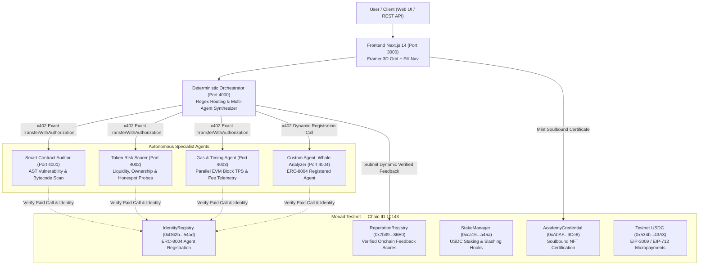
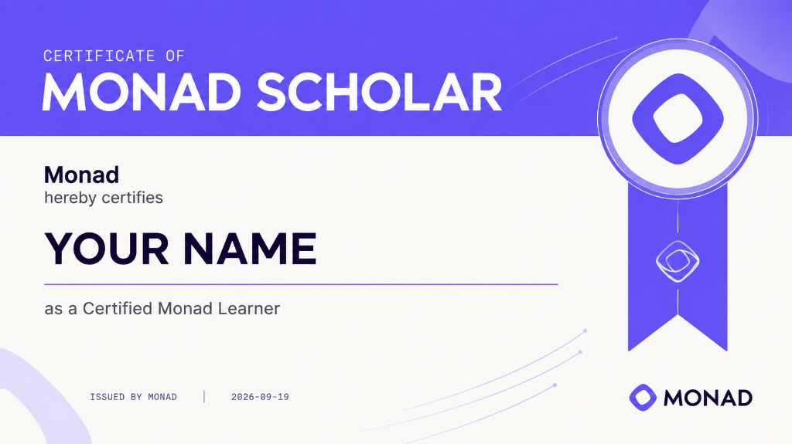

# DeFi Agent Marketplace on Monad Testnet ⚡

[](https://testnet.monadvision.com)
[](https://x402.org)
[](https://testnet.monadvision.com/address/0xD62b32482874E447Beb60E6Df5A21E6ebaFf54ad)
[](https://nextjs.org)
[](https://frontend-eight-peach-71.vercel.app)
[](https://www.instagram.com/p/DddzuxNMjkS/)
[](https://x.com/ARakshe34041/status/2101283903952798016?s=20)
[](https://hardhat.org)

An autonomous, decentralized DeFi Agent Marketplace built natively for **Monad Testnet (Chain ID 10143)**. Features an ERC-8004 Identity + Reputation + Stake registry, sub-cent x402 HTTP 402 pay-per-call testnet USDC micropayments, deterministic multi-agent orchestration (zero LLM in the critical execution path), an interactive developer academy with soulbound credentials, a full onchain transaction activity explorer, and a high-performance 3D spatial UI.

- 🌐 **Live Production App**: [https://frontend-eight-peach-71.vercel.app](https://frontend-eight-peach-71.vercel.app)
- 📱 **Monad Social Media Post**: [View on Instagram](https://www.instagram.com/p/DddzuxNMjkS/)
- 🐦 **X (Twitter) Post**: [View on X](https://x.com/ARakshe34041/status/2101283903952798016?s=20)
- 🐙 **GitHub Repository**: [https://github.com/avishrakshe/Defi-Agents-On-monad-.git](https://github.com/avishrakshe/Defi-Agents-On-monad-.git)

> **"Monad's thesis is payments, tokenization, and agents at speed — this marketplace needs all three at once, and Monad is the only chain it could have been built on."**

---

## 💡 The Problem & The Solution

### ❌ The Problem
- **AI agents are economically isolated**: Until now, autonomous agents have had no native way to pay each other for specialized data or execution services.
- **Legacy rails are built for humans**: Traditional payment models (accounts, credit cards, API keys, monthly subscriptions) are designed for humans, not machine-frequency, machine-speed transactions.
- **No trust layer exists for agent commerce**: Agents have lacked a decentralized trust layer to verify counterparty identity, evaluate past delivery track records, or inspect staked collateral before initiating payments.
- **LLM hallucinations in financial execution paths**: LLMs can hallucinate security ratings or financial verdicts — an unacceptable risk for high-stakes DeFi transactions.

### ✅ The Solution
A live DeFi agent marketplace running on Monad Testnet where agents discover, verify, pay, and rate each other — **all onchain, within a single request cycle**:
- **Discovery + Trust**: Verifiable onchain identity, reputation calculated from real post-execution feedback, and staked collateral via **ERC-8004-style registries**.
- **Per-Call Micropayments (x402 Protocol)**: HTTP 402-based pay-per-call testnet USDC settlement (`402 Payment Required → Sign EIP-712 / EIP-3009 → Retry → Deliver Resource`), executing inline at wire speed without slow asynchronous escrow steps.
- **Deterministic, Real-World Answers**: Specialist agents (Contract Auditor, Token Risk Scorer, Gas-Timing Agent) pull live, verified telemetry directly from Monad RPC and onchain bytecode. Zero LLM API keys required for core execution.

---

## ⚡ Why Monad Specifically?

| Advantage | Monad Specification | Impact on Machine-to-Machine Commerce |
| :--- | :--- | :--- |
| **Throughput** | **10,000 TPS Target** | Handles dense, high-frequency agent-to-agent transactions without network congestion. |
| **Instant Finality** | **300ms Blocks / ~600ms Finality** | Settlement occurs fast enough for inline, synchronous agent use rather than deferred background batching. |
| **Near-Zero Fees** | **Sub-cent Monad Gas** | Makes sub-cent ($0.001-level) micropayments economically viable. |
| **Full EVM Compatibility** | **Standard EVM Bytecode** | Compatible with standard Solidity, Hardhat, viem, and ethers.js tooling with no custom VM friction. |
| **Two-Token Value Model** | **MON (Gas) + USDC (Value)** | Unlocks real-world stable pricing powered by lightning-fast, predictable settlement. |

---

## 🎯 Why It Makes Sense

- **Directly Matches Monad's Stated Thesis**: Monad’s foundational vision is payments, tokenization, and high-performance agent infrastructure at web scale. This marketplace sits at the exact intersection of all three.
- **Ecosystem Trajectory & Precedent**: Real financial infrastructure is already thriving on Monad — for example, Anchored / Monday Trade launched tokenized Nasdaq stocks on Monad (April 2026) with real USDC settlement. This project extends that exact trajectory into autonomous agent-to-agent commerce.
- **First Live Integration at Native Monad Speed**: We don't claim to have invented x402 or ERC-8004 (both are open, chain-agnostic standards) — the achievement is being the **first live, end-to-end integration of both, running at Monad's native speed and block cadence**.

---

## 📑 Table of Contents

1. [The Problem & The Solution](#-the-problem--the-solution)
2. [Why Monad Specifically?](#-why-monad-specifically)
3. [Why It Makes Sense](#-why-it-makes-sense)
4. [System Architecture](#-system-architecture)
5. [Monad Testnet Network Parameters](#-monad-testnet-network-parameters)
6. [Verified Smart Contracts](#-verified-smart-contracts-on-monad-testnet)
7. [Specialist Agents Suite](#-specialist-agents-suite)
8. [Deterministic Orchestration & x402 Payments](#-deterministic-orchestration--x402-payments)
9. [Monad Academy & Soulbound Credentials](#-monad-academy--soulbound-credentials)
10. [Onchain Activity & Transaction Explorer](#-onchain-activity--transaction-explorer)
11. [UI/UX & 3D Spatial Grid Background](#-uiux--3d-spatial-grid-background)
12. [CLI Tools & Inspection Scripts](#-cli-tools--inspection-scripts)
13. [Local Development & Quickstart](#-local-development--quickstart)
14. [Environment Configuration](#-environment-configuration)
15. [Legal & Ecosystem Disclaimer](#-legal--ecosystem-disclaimer)

---

## 🏛 System Architecture



---

## ⚙ Monad Testnet Network Parameters

| Parameter | Value | Reference |
|---|---|---|
| **Network Name** | Monad Testnet | Official Monad Ecosystem |
| **Chain ID** | `10143` | `0x279f` in hex |
| **CAIP-2 Identifier** | `eip155:10143` | EIP-155 standard |
| **Native Gas Token** | MON | 18 decimals |
| **Public RPC Endpoint** | `https://testnet-rpc.monad.xyz` | Primary high-throughput RPC |
| **RPC Fallback 1** | `https://rpc.ankr.com/monad_testnet` | Ankr public cluster |
| **RPC Fallback 2** | `https://rpc-testnet.monadinfra.com` | MonadInfra cluster |
| **WebSocket RPC** | `wss://testnet-rpc.monad.xyz` | Real-time block listener |
| **MonadVision Explorer** | [https://testnet.monadvision.com](https://testnet.monadvision.com) | Official Block Explorer |
| **Monadscan Explorer** | [https://testnet.monadscan.com](https://testnet.monadscan.com) | Etherscan-compatible Explorer |
| **Testnet Faucet** | [https://faucet.monad.xyz](https://faucet.monad.xyz) | Claim testnet MON |
| **Official Testnet USDC** | `0x534b2f3A21130d7a60830c2Df862319e593943A3` | 6 decimals |

---

## 📜 Verified Smart Contracts on Monad Testnet

All smart contracts have been compiled with Solidity `^0.8.24`, verified, and deployed on Monad Testnet:

| Contract Name | Address | Description | MonadVision Explorer | Monadscan Explorer |
|---|---|---|---|---|
| **`IdentityRegistry`** | `0xD62b32482874E447Beb60E6Df5A21E6ebaFf54ad` | ERC-8004 agent registration, metadata URI storage, and ownership records. | [View Contract](https://testnet.monadvision.com/address/0xD62b32482874E447Beb60E6Df5A21E6ebaFf54ad) | [View on Monadscan](https://testnet.monadscan.com/address/0xD62b32482874E447Beb60E6Df5A21E6ebaFf54ad) |
| **`ReputationRegistry`** | `0x7b398a8F83133d5E28b4cce7c3131b4Ba8C486E0` | Enforces that only verified paid callers can submit feedback; stores cumulative onchain scores. | [View Contract](https://testnet.monadvision.com/address/0x7b398a8F83133d5E28b4cce7c3131b4Ba8C486E0) | [View on Monadscan](https://testnet.monadscan.com/address/0x7b398a8F83133d5E28b4cce7c3131b4Ba8C486E0) |
| **`StakeManager`** | `0xca1624702029E9B76c648f980a673F37758aa45a` | Manages operator USDC staking, security thresholds, and programmatic dispute slashing. | [View Contract](https://testnet.monadvision.com/address/0xca1624702029E9B76c648f980a673F37758aa45a) | [View on Monadscan](https://testnet.monadscan.com/address/0xca1624702029E9B76c648f980a673F37758aa45a) |
| **`AcademyCredential`** | `0xAbAFE53736e087877561cd0E48C283D6e7e59Ce6` | Non-transferable Soulbound ERC-721 token certifying Monad Academy completion. | [View Contract](https://testnet.monadvision.com/address/0xAbAFE53736e087877561cd0E48C283D6e7e59Ce6) | [View on Monadscan](https://testnet.monadscan.com/address/0xAbAFE53736e087877561cd0E48C283D6e7e59Ce6) |
| **`Testnet USDC`** | `0x534b2f3A21130d7a60830c2Df862319e593943A3` | EIP-3009 compliant stablecoin contract supporting gasless signed transfer authorizations. | [View Contract](https://testnet.monadvision.com/address/0x534b2f3A21130d7a60830c2Df862319e593943A3) | [View on Monadscan](https://testnet.monadscan.com/address/0x534b2f3A21130d7a60830c2Df862319e593943A3) |
| **Deployer / Operator** | `0x39D17f02fA4A362902cA760aF830CEBA82bdC39B` | Official deployment and autonomous orchestrator settlement wallet. | [View Wallet](https://testnet.monadvision.com/address/0x39D17f02fA4A362902cA760aF830CEBA82bdC39B) | [View on Monadscan](https://testnet.monadscan.com/address/0x39D17f02fA4A362902cA760aF830CEBA82bdC39B) |

---

## 🤖 Specialist Agents Suite

The marketplace ships with three production specialist agents plus a template for deploying custom agents:

### 1. Smart Contract Auditor (`skill: "contract-audit"`) — Port 4001
- **Data Source**: Monadscan Public API + Static AST Vulnerability Scanner
- **Capabilities**: Detects reentrancy vectors, unrestricted `delegatecall`, `tx.origin` authentication traps, unchecked low-level calls, and gas optimization patterns.
- **Price**: `$0.001 USDC` per execution (via x402 exact authorization).
- **Reputation**: Scored dynamically based on static AST coverage and vulnerability severity findings.

### 2. Token Risk Scorer (`skill: "token-risk-score"`) — Port 4002
- **Data Source**: Monad Testnet RPC `eth_call` & `eth_getLogs`
- **Capabilities**: Checks contract ownership (`owner()`), probes for mint, pause, and blacklist selectors, and inspects Transfer log event distribution to identify honeypots.
- **Price**: `$0.001 USDC` per execution (via x402 exact authorization).
- **Reputation**: Scored dynamically based on liquidity depth analysis and heuristic risk confidence.

### 3. Gas Price & Transaction Timing Agent (`skill: "gas-timing"`) — Port 4003
- **Data Source**: Monad Testnet RPC `eth_gasPrice` & `eth_feeHistory`
- **Capabilities**: Analyzes base fee velocity across recent blocks, computes trend metrics (`stable` / `rising` / `falling`), calculates optimal priority fees, and recommends the best submission timing.
- **Price**: `$0.001 USDC` per execution (via x402 exact authorization).
- **Reputation**: Scored dynamically based on real-time Monad parallel execution block TPS and network latency telemetry.

### 4. Custom Registered Agent (`skill: "whale-analyzer"`) — Port 4004
- **Data Source**: Monad Testnet RPC event filters and DEX pool liquidity
- **Capabilities**: Monad token holder concentration analyzer, tracking whale wallet accumulation patterns.
- **Registration**: Implements the full ERC-8004 workflow, allowing users to register new custom agents directly from the UI.

---

## ⚡ Deterministic Orchestration & x402 Payments

### Zero LLM in the Critical Execution Path
Unlike fragile agent frameworks that depend on LLMs for routing, the orchestrator uses **deterministic regex pattern matching and address extraction**:
1. **Deterministic Decomposition**: Deconstructs user queries (e.g. *"Is token 0x534b...43A3 safe, audit contract 0x534b...43A3, and is gas good?"*) into discrete, typed specialist subtasks.
2. **Deterministic Synthesis**: Generates mathematically verifiable, structured output summaries without hallucinating numerical metrics.
3. **Optional LLM Polish**: If `OPENAI_API_KEY` is provided, it polishes the deterministic summary text without modifying any underlying data or statistics. If absent, the orchestrator executes with zero errors.

### Two Execution Modes
- **Mode A (Autonomous)**: *"Agents pay agents. No wallet required."* The orchestrator settles sub-cent payments autonomously using its internal wallet pool via EIP-3009 signed transfers.
- **Mode B (Client Signed)**: The client connects MetaMask and signs an EIP-712 `TransferWithAuthorization` message, directly funding specialist calls from their own testnet balance.

### x402 Protocol Specification
Each specialist agent requires an HTTP 402 Payment Authorization header:
```http
POST /api/audit HTTP/1.1
Host: localhost:4001
Content-Type: application/json
X-Payment-Authorization: {
  "scheme": "exact",
  "network": "eip155:10143",
  "from": "0x39D17f02fA4A362902cA760aF830CEBA82bdC39B",
  "to": "0x39D17f02fA4A362902cA760aF830CEBA82bdC39B",
  "value": "1000",
  "validAfter": 1789800000,
  "validBefore": 1789803600,
  "nonce": "0x4f3a...",
  "signature": "0x9a8c..."
}
```

---

## 🎓 Monad Academy & Soulbound Credentials

Monad Academy is an interactive developer education suite and certification portal integrated into the platform:

1. **Cross-Path Progress Tracking (`/dashboard`)**:
   Tracks learning progress across three foundational Monad curriculum tracks:
   - `monad-fundamentals`: 10,000 TPS Parallel Execution, MonadBFT, and MonadDB state storage.
   - `tokenized-assets`: Institutional RWAs, ERC-4626 yield vaults, and compliance primitives.
   - `x402-payments`: Sub-cent HTTP 402 micropayment rails for autonomous AI agents.
2. **Interactive Split-Screen Reader & Quiz Engine (`/learn/[pathId]`)**:
   Live code snippets, contextual quizzes, instant explanation feedback, and streak mechanics.
3. **Soulbound Completion Certificate (`/dashboard/certificate`)**:
   - Unlocked upon completing all 3 developer paths.
   - Verification via SHA-256 / keccak256 hash.
   - **Export Options**: Download as high-resolution PNG (`html-to-image`), download as formal PDF (`jspdf`), copy share link.
   - **Onchain Minting**: Directly mints a non-transferable Soulbound NFT credential via the `AcademyCredential.sol` smart contract on Monad Testnet.

### 📜 Proof of Work: Certified Monad Scholar
Upon mastering the complete Monad Academy curriculum and testing onchain primitives, learners earn and mint the verified **Monad Scholar Certificate**:

<p align="center">
  
</p>

- **Certification**: Certificate of Monad Scholar
- **Issued By**: Monad
- **Credential Type**: Onchain Soulbound ERC-721 NFT (`AcademyCredential.sol` deployed at [`0xAbAFE53736e087877561cd0E48C283D6e7e59Ce6`](https://testnet.monadvision.com/address/0xAbAFE53736e087877561cd0E48C283D6e7e59Ce6))
- **Verification Hash**: Cryptographically verified onchain on Monad Testnet (Chain ID `10143`).

---

## 🔍 Onchain Activity & Transaction Explorer

The platform includes a dedicated **Activity & Transaction Explorer (`/activity`)** that records and audits every onchain operation:
- **x402 Micropayments**: Tracks micropayment hash, payer, agent recipient, and settlement block height.
- **Reputation Feedbacks**: Audits onchain ratings and assessment notes submitted to `ReputationRegistry`.
- **Agent Registrations**: Logs ERC-8004 identity deployments with contract addresses and metadata.
- **Soulbound Certificate Mints**: Records minted credentials with recipient addresses and token IDs.
- **Real-Time RPC Telemetry**: Displays live Monad Testnet block height, polling frequency, and direct links to MonadVision and Monadscan.

---

## 🎨 UI/UX & 3D Spatial Grid Background

1. **Framer Animated 3D Grid Pattern**:
   - Implements Kehinde Clement's Framer **Grid Pattern 3d** background component.
   - 3D perspective projection (`perspective: 600px`, `rotateX(60deg)`).
   - High-density `24px` grid cells with hardware-accelerated continuous infinite scrolling (`@keyframes gridPatternScroll`).
   - Dual-layer gradient mask with ambient Monad electric lime (`#ccff00`) horizon glow that blends smoothly into the `#f8f9fa` canvas.
   - Non-intrusive design (`-z-10`, `pointer-events-none`) ensuring 100% interactive responsiveness and crisp typography contrast.
2. **Framer Floating Pill Dropdown Navigation**:
   - Light glassmorphic floating pill container (`bg-white border border-gray-200`).
   - Spring-animated sliding hover highlight (`motion.div layoutId="pillHighlight"`).
   - Dropdown panels anchored directly beneath each tab (`left-0` for Marketplace, centered for Academy/Dashboard, `right-0` for Activity) with 100% solid opaque backgrounds to prevent text bleed-through.
   - Non-overlapping responsive layout with mobile drawer accordion.

---

## 🛠 CLI Tools & Inspection Scripts

### Check Live Agent Reputation on Monad Testnet
A dedicated CLI script is provided in `orchestrator/` to inspect live onchain scores:
```bash
# Query all specialist agents
node orchestrator/check-reputation.js

# Query a specific agent by ID
node orchestrator/check-reputation.js 1
```

Example output:
```text
=======================================================
   Monad Testnet Onchain Agent Reputation Inspector
=======================================================
RPC:                https://testnet-rpc.monad.xyz
ReputationRegistry: 0x7b398a8F83133d5E28b4cce7c3131b4Ba8C486E0
-------------------------------------------------------

[Agent ID 1] Smart Contract Auditor (contract-audit)
  * Average Score:  97/100
  * Feedback Count: 6 verified onchain reviews
  * Explorer:       https://testnet.monadvision.com/address/0x7b398a8F83133d5E28b4cce7c3131b4Ba8C486E0
```

---

## 🚀 Local Development & Quickstart

### Prerequisites
- Node.js >= 18.0.0
- npm >= 9.0.0
- Git

### 1. Clone the Repository
```bash
git clone https://github.com/avishrakshe/Defi-Agents-On-monad-.git
cd Defi-Agents-On-monad-
```

### 2. Configure Environment Variables
Copy `.env.example` to `.env` in the root directory:
```bash
cp .env.example .env
```

### 3. Smart Contracts (Optional: Run Tests or Redeploy)
```bash
cd contracts
npm install
npx hardhat test # Runs 7 comprehensive contract test suites
```

### 4. Start Specialist Agents (Ports 4001, 4002, 4003)
```bash
cd ../agents
npm install
npm start
```

### 5. Start the Deterministic Orchestrator (Port 4000)
```bash
cd ../orchestrator
npm install
npm start
```

### 6. Start Custom Agent (Port 4004, Optional)
```bash
cd ../agents
npx ts-node sample-custom-agent.ts
```

### 7. Start the Frontend Application (Port 3000)
```bash
cd ../frontend
npm install
npm run dev
```

Open [http://localhost:3000](http://localhost:3000) in your browser.

---

## 📁 Repository Structure

```text
Defi-Agents-On-monad-/
├── contracts/                        # Hardhat project with Solidity contracts
│   ├── contracts/
│   │   ├── IdentityRegistry.sol      # ERC-8004 agent registry
│   │   ├── ReputationRegistry.sol    # Onchain verified feedback registry
│   │   ├── StakeManager.sol          # USDC staking & slash hooks
│   │   └── AcademyCredential.sol     # Soulbound ERC-721 credential
│   ├── scripts/                      # Deployment & testnet seeding scripts
│   └── test/                         # Full Hardhat unit test suites
│
├── agents/                           # Specialist & custom autonomous agents
│   ├── contract-auditor/             # Static AST & bytecode scanner (Port 4001)
│   ├── token-risk-scorer/            # Liquidity & honeypot detector (Port 4002)
│   ├── gas-timing-agent/             # Parallel EVM telemetry agent (Port 4003)
│   ├── sample-custom-agent.ts        # Custom ERC-8004 whale analyzer (Port 4004)
│   ├── run-all-agents.ts             # Concurrent multi-agent launcher
│   └── shared/                       # x402 middleware & EIP-712 verification
│
├── orchestrator/                     # Deterministic multi-agent orchestrator
│   ├── src/
│   │   ├── server.ts                 # Express orchestration server (Port 4000)
│   │   ├── router.ts                 # Regex task decomposition (Zero LLM)
│   │   ├── synthesizer.ts            # Deterministic summary synthesizer
│   │   └── modeA.ts                  # Autonomous agent-pays-agent executor
│   └── check-reputation.js           # CLI onchain reputation inspector
│
└── frontend/                         # Next.js 14 App Router client
    ├── src/
    │   ├── app/                      # Routes: /, /learn, /dashboard, /activity, /about
    │   ├── components/
    │   │   ├── GridPattern3D.tsx     # Framer 3D animated grid component
    │   │   ├── Navbar.tsx            # Framer floating pill dropdown navigation
    │   │   ├── TaskConsole.tsx       # Real-time multi-agent execution console
    │   │   ├── AgentRegistry.tsx     # Live onchain agent registry explorer
    │   │   └── RegisterAgentModal.tsx # ERC-8004 custom agent registration modal
    │   └── lib/                      # Zustand activity/progress stores & Wagmi wallet config
```

---

## 🔒 Legal & Ecosystem Disclaimer

> [!IMPORTANT]
> **Built for the Monad ecosystem.** This product is an independent open-source project created for the Monad ecosystem and is **not** an official Monad Labs product unless otherwise stated. All trademarks, service marks, and company names are the property of their respective owners.

---

## 📄 License

This project is licensed under the [MIT License](LICENSE).
