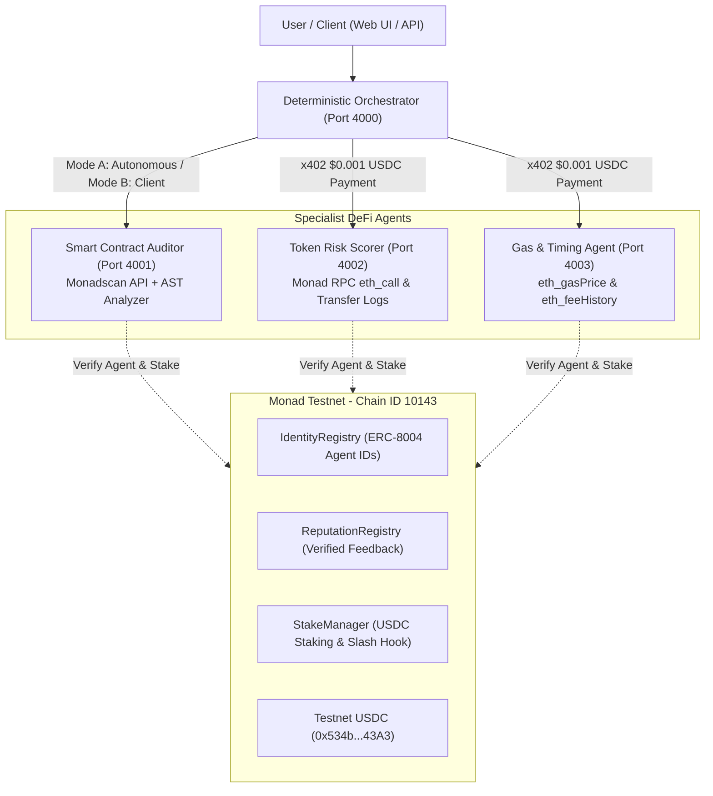

# DeFi Agent Marketplace on Monad Testnet ⚡

An autonomous, decentralized DeFi Agent Marketplace built on **Monad Testnet (Chain ID 10143)**. Features an ERC-8004-style Identity + Reputation + Stake system, x402-compatible pay-per-call testnet USDC micropayments, deterministic task routing with zero LLM critical path dependency, and three live specialist agents.

GitHub Repository: [https://github.com/avishrakshe/Defi-Agents-On-monad-.git](https://github.com/avishrakshe/Defi-Agents-On-monad-.git)

---

## Architecture Overview



---

## Monad Testnet Official Parameters

| Parameter | Value |
|---|---|
| **Network Name** | Monad Testnet |
| **Chain ID** | `10143` |
| **CAIP-2** | `eip155:10143` |
| **Native Currency** | MON |
| **Public RPC** | `https://testnet-rpc.monad.xyz` |
| **RPC Fallback 1** | `https://rpc.ankr.com/monad_testnet` |
| **RPC Fallback 2** | `https://rpc-testnet.monadinfra.com` |
| **WebSocket RPC** | `wss://testnet-rpc.monad.xyz` |
| **Block Explorer (MonadVision)** | [https://testnet.monadvision.com](https://testnet.monadvision.com) |
| **Block Explorer (Monadscan)** | [https://testnet.monadscan.com](https://testnet.monadscan.com) |
| **Official Faucet** | [https://faucet.monad.xyz](https://faucet.monad.xyz) |
| **x402 Facilitator** | `https://x402-facilitator.molandak.org` |
| **Testnet USDC** | `0x534b2f3A21130d7a60830c2Df862319e593943A3` |

---

## Deployed Smart Contracts

The contracts implement ERC-8004 identity, onchain feedback with caller payment verification, and USDC staking with a stubbed dispute slash hook:

| Contract | Address | Explorer Verification Link |
|---|---|---|
| **IdentityRegistry** | `0xD62b32482874E447Beb60E6Df5A21E6ebaFf54ad` | [View on MonadVision](https://testnet.monadvision.com/address/0xD62b32482874E447Beb60E6Df5A21E6ebaFf54ad) / [Monadscan](https://testnet.monadscan.com/address/0xD62b32482874E447Beb60E6Df5A21E6ebaFf54ad) |
| **ReputationRegistry** | `0x7b398a8F83133d5E28b4cce7c3131b4Ba8C486E0` | [View on MonadVision](https://testnet.monadvision.com/address/0x7b398a8F83133d5E28b4cce7c3131b4Ba8C486E0) / [Monadscan](https://testnet.monadscan.com/address/0x7b398a8F83133d5E28b4cce7c3131b4Ba8C486E0) |
| **StakeManager** | `0xca1624702029E9B76c648f980a673F37758aa45a` | [View on MonadVision](https://testnet.monadvision.com/address/0xca1624702029E9B76c648f980a673F37758aa45a) / [Monadscan](https://testnet.monadscan.com/address/0xca1624702029E9B76c648f980a673F37758aa45a) |


---

## Three Specialist DeFi Agents

### 1. Smart Contract Auditor (`skill: "contract-audit"`) — Port 4001
- **Data Source**: Monadscan Public API + Local Static AST Vulnerability Scanner
- **Capabilities**: Detects reentrancy risks, unrestricted `delegatecall`, `tx.origin` authorization bypasses, unchecked low-level calls, and gas optimizations.
- **Price**: `$0.001 USDC` per call (via x402 exact scheme).

### 2. Token Risk Scorer (`skill: "token-risk-score"`) — Port 4002
- **Data Source**: Monad Testnet RPC `eth_call` & `eth_getLogs`
- **Capabilities**: Checks contract ownership (`owner()`), probes for mint/pause/blacklist function selectors, and analyzes Transfer log event distribution.
- **Output**: Deterministic score `0-100` and detailed audit explanation.
- **Price**: `$0.001 USDC` per call (via x402 exact scheme).

### 3. Gas Price & Transaction Timing Agent (`skill: "gas-timing"`) — Port 4003
- **Data Source**: Monad Testnet RPC `eth_gasPrice` & `eth_feeHistory`
- **Capabilities**: Calculates current base fee velocity across recent blocks, computes trend (`stable` / `rising` / `falling`), optimal priority fees, and recommended submission timing.
- **Price**: `$0.001 USDC` per call (via x402 exact scheme).

---

## Orchestrator: Deterministic Routing (No LLM in Critical Path)

- **Task Decomposition**: Regex keyword and address matching decompose complex natural-language tasks into discrete subtasks. Zero LLM calls are used for routing.
- **Result Synthesis**: Deterministic template summary is computed unconditionally.
- **Optional LLM Polish**: If `OPENAI_API_KEY` or `ANTHROPIC_API_KEY` is present, it rewrites the deterministic summary for polish without altering numbers. If absent, the deterministic summary is returned directly with zero errors.
- **Modes**:
  - **Mode A (Autonomous)**: "Agents pay agents. No wallet required." Orchestrator settles payments using its internal agent pool.
  - **Mode B (Your Wallet)**: Client provides signed EIP-3009 authorizations.

---

## Running Locally

### Prerequisites
- Node.js >= 18 (Tested on v24)
- npm >= 9

### 1. Start Smart Contracts & Hardhat Tests
```bash
cd contracts
npm install
npx hardhat test
npx hardhat run scripts/deploy-and-seed.ts --network hardhat
```

### 2. Start the 3 Specialist Agents
```bash
cd agents
npm install
npm start # Launches Auditor on 4001, Token Risk on 4002, Gas Timing on 4003
```

### 3. Start the Orchestrator
```bash
cd orchestrator
npm install
npm start # Launches Orchestrator on 4000
```

### 4. Start the Frontend
```bash
cd frontend
npm install
npm run dev # Launches UI on http://localhost:3000
```

---

## Environment Variables (.env)

```env
# Monad Testnet Network Configuration
NEXT_PUBLIC_MONAD_NETWORK="eip155:10143"
NEXT_PUBLIC_MONAD_CHAIN_ID="10143"
NEXT_PUBLIC_MONAD_RPC_URL="https://testnet-rpc.monad.xyz"
NEXT_PUBLIC_MONAD_USDC_ADDRESS="0x534b2f3A21130d7a60830c2Df862319e593943A3"

# x402 Protocol
X402_FACILITATOR_URL="https://x402-facilitator.molandak.org"
PAY_TO_ADDRESS="[WALLET_ADDRESS]"

# Agent Endpoints
CONTRACT_AUDITOR_URL="http://localhost:4001"
TOKEN_RISK_URL="http://localhost:4002"
GAS_TIMING_URL="http://localhost:4003"
ORCHESTRATOR_URL="http://localhost:4000"

# Optional Keys (Off critical path)
DEPLOYER_PRIVATE_KEY="[PRIVATE_KEY]"
OPENAI_API_KEY=""
```
